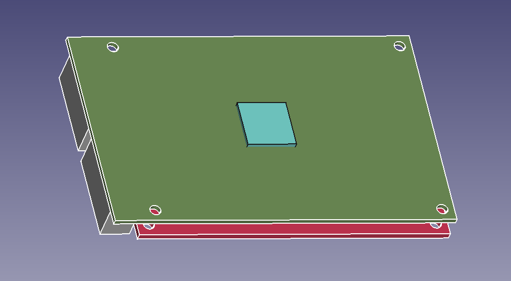
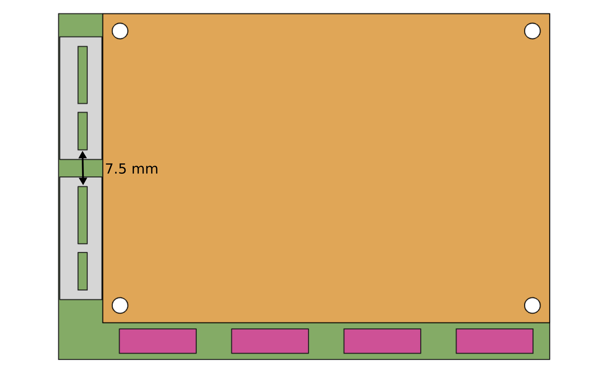

# Mechanical design

The AXIOM micro uses a similiar mecanical concept as the beta. An of the shelf FPGA development board is stacked
on top of custom boards. However, the AXIOM micro only uses one board to do power management, CCD interfacing and for
holding the plugin modules.

The same mecanical interface for plugin modules is present. Two PCIe x1 conectors are arranged in this way:

A 3D concept of the pcb stack can be found in the solvespace document `main.slvs`.
